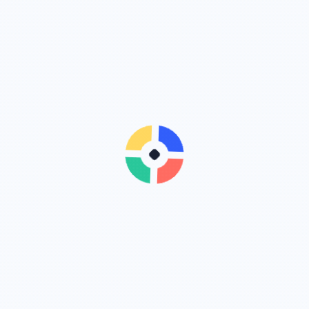

# EVER NEW Official Website

The public portfolio and product directory for Wilson / HachikoJ. It links to independent product subdomains while keeping the brand site at `www.deline.top`.

Website: https://www.deline.top/



## Quick start

Requires Node.js 20+.

```bash
npm install
npm run dev       # http://localhost:8081
npm run lint
npm run build
```

The static export is written to `out/`; `npm run start` serves it locally.

## Product routes

| Product | Address | Status |
| --- | --- | --- |
| Feynman Reader | https://reader.deline.top/ | Live |
| AnonyProof | https://anonyproof.deline.top/ | Public preview |
| StarVault Imprint | https://starvault.deline.top/ | In development |
| Magic Draw Kids | https://magic-draw-kids.deline.top/ | In development |

Integration and handoff rules are in [`docs/product-integration.md`](docs/product-integration.md).

## Deployment

The site is a Next.js static export. See [`deploy.sh`](deploy.sh) and [`www.deline.top.conf`](www.deline.top.conf) for the Tencent Cloud/Nginx example. The bare domain redirects with HTTP 308 to `www.deline.top`; the legacy `/reader/` path redirects to the reader subdomain.

## Privacy and feedback

The site stores only the language preference in browser `localStorage` and does not collect form submissions. Report issues through [GitHub Issues](https://github.com/HachikoJ/ever-new-website/issues).

## License

MIT. See [`LICENSE`](LICENSE).

## Project trends

[](https://star-history.com/#HachikoJ/ever-new-website&Date)

[](https://github.com/HachikoJ/ever-new-website)
